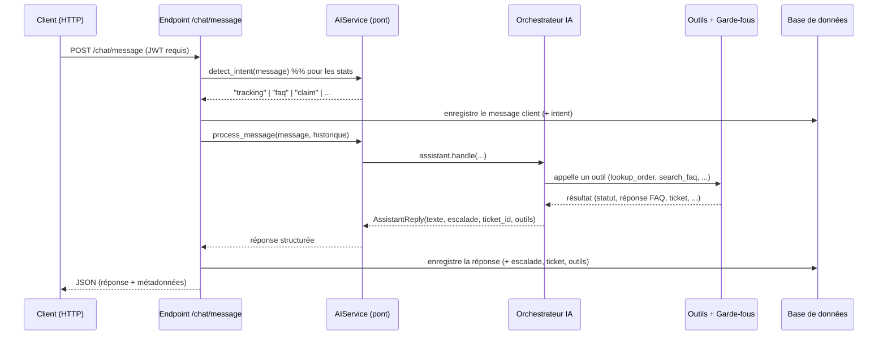

# Documentation Technique — Assistant IA TexMiles

> **Projet :** Assistant conversationnel de service client pour TexMiles (groupe Logidoo).
> **Contexte :** Soutenance de fin d'études & MVP de production.
> **Branche :** `merged-final` — fusion des deux travaux (voir §2).

Ce document explique **l'architecture**, **le rôle de chaque partie**, **comment ça
fonctionne**, et **qui a construit quoi**. Pour la procédure de test pas à pas, voir le
fichier compagnon **[GUIDE_DE_TEST.md](GUIDE_DE_TEST.md)**.

---

## 1. Vue d'ensemble

L'assistant répond automatiquement aux demandes courantes du service client TexMiles
(suivi de commande, questions fréquentes, réclamations) et **passe la main à un humain**
quand il le faut. Il expose :

- une **API web** (FastAPI) avec authentification et historique persistant,
- un **moteur d'IA** qui comprend le langage naturel et agit via des **outils**,
- un **tableau de bord** de statistiques d'usage.

Périmètre actuel : **français, texte, un modèle à la fois**. Le vocal, le wolof, WhatsApp
et les messages proactifs sont prévus pour les milestones suivants — l'architecture est
faite pour les accueillir sans réécriture.

---

## 2. La fusion : qui a construit quoi

Le projet réunit deux contributions complémentaires — **une maison** (l'infrastructure)
et **un cerveau** (l'intelligence).

| Brique | Origine | Rôle |
|--------|---------|------|
| Architecture FastAPI en couches (`api/core/db/models/schemas/services`) | Backend | Structure professionnelle, prête pour la production |
| **Authentification JWT** (`auth`, `security`) | Backend | Comptes utilisateurs, routes protégées |
| **Persistance** SQLAlchemy (`models`, `db`) | Backend | Historique des conversations en base |
| **Détection d'intention** (superviseur) | Backend | Classe chaque message pour les statistiques |
| **Moteur / Orchestrateur** (`app/intelligence`) | IA | Traite réellement la demande via des outils |
| **Outils** (suivi, FAQ, réclamation, escalade) | IA | Actions concrètes contrôlées par le code |
| **Garde-fous** (identité, escalade, anti-invention) | IA | Sécurité imposée par le code |
| **Couche modèle interchangeable** (providers) | IA | Groq / Gemini / Grok / OpenAI / Ollama |
| **Harnais d'évaluation** (`eval/`) | IA | 12 scénarios de recette automatisés |
| **Tableau de bord** (`dashboard`) | Fusion | Statistiques d'usage (CDC §4.8) |

**Idée clé de la fusion :** dans la version initiale du backend, les « agents métiers »
(suivi, réclamation, FAQ) étaient des **maquettes** qui renvoyaient un texte figé. La
fusion **remplace ces maquettes par le vrai moteur d'IA** (orchestrateur + outils +
garde-fous), tout en gardant l'infrastructure (auth, base de données, détection
d'intention, API).

---

## 3. Architecture générale

```
apichat/
├─ app/
│  ├─ main.py                # Application FastAPI (santé, CORS, montage des routes)
│  ├─ core/
│  │  ├─ config.py           # Configuration centrale (pydantic-settings, .env)
│  │  └─ security.py         # Hachage mots de passe + JWT
│  ├─ api/v1/
│  │  ├─ router.py           # Agrège les routes
│  │  └─ endpoints/
│  │     ├─ auth.py          # /auth : register, login, me
│  │     ├─ chat.py          # /chat : message, history
│  │     └─ dashboard.py     # /dashboard : stats
│  ├─ db/                    # Session SQLAlchemy + Base
│  ├─ models/                # Tables : User, ChatMessage
│  ├─ schemas/               # Schémas Pydantic (entrées/sorties API)
│  ├─ services/
│  │  ├─ auth_service.py     # Logique d'authentification
│  │  └─ ai_service.py       # PONT : détection d'intention + orchestrateur
│  └─ intelligence/          # ===== LE MOTEUR IA =====
│     ├─ config.py           # Construit l'assistant depuis les settings
│     ├─ orchestrator.py     # Le "cerveau" : boucle outils + garde-fous
│     ├─ orders.py           # Source des commandes + vérification d'identité
│     ├─ faq.py              # Recherche dans la base FAQ (RAG simple)
│     ├─ guardrails.py       # Filet de sécurité d'escalade
│     ├─ prompt_fr.py        # Consignes de comportement (system prompt)
│     └─ providers/          # Connecteurs LLM (interface + compatible OpenAI)
├─ data/
│  ├─ orders.mock.json       # Commandes FICTIVES (remplaçables par la vraie API)
│  └─ faq.fr.json            # Base FAQ éditable sans toucher au code
├─ eval/                     # Harnais de test (12 scénarios) + run_eval.py
├─ tests/                    # Tests pytest (auth + chat, mockés)
├─ cli.py                    # Chat en ligne de commande (sans serveur)
├─ main.py                   # Raccourci vers app.main:app
└─ requirements.txt
```

---

## 4. Le parcours d'un message



Deux étapes distinctes, chacune issue d'une contribution :
1. **`detect_intent`** (superviseur) : une classification rapide, uniquement pour
   alimenter le tableau de bord (répartition par type de demande).
2. **`process_message`** (orchestrateur) : le vrai traitement, qui décide quels outils
   utiliser et applique les garde-fous.

> Les deux réutilisent **la même connexion au modèle** (le provider est construit une
> seule fois), donc changer de modèle dans le `.env` change tout d'un coup.

---

## 5. Le moteur d'intelligence (`app/intelligence`)

### 5.1 L'orchestrateur (`orchestrator.py`)
Le « cerveau ». Pour chaque message, il envoie au modèle le prompt système, l'historique
et la **liste des outils disponibles**, puis exécute les outils que le modèle demande
(boucle limitée à 5 tours pour éviter tout emballement). Il renvoie un objet structuré
`AssistantReply` : `texte`, `escalade`, `raison_escalade`, `ticket_id`, `outils_utilises`.

Les **outils** (le modèle choisit lequel appeler) :

| Outil | Rôle |
|-------|------|
| `lookup_order(numero, telephone, email)` | Retrouve une commande **après vérification d'identité** et renvoie son statut |
| `search_faq(requete)` | Cherche la réponse dans la base FAQ |
| `create_complaint(numero, description)` | Ouvre une réclamation et renvoie un numéro de ticket |
| `escalate_to_human(raison)` | Transfère la conversation à un agent humain |

### 5.2 Les garde-fous (`guardrails.py` + `orders.py`)
Les règles critiques sont appliquées **dans le code**, pas seulement dans le prompt
(un prompt peut être contourné par une formulation habile) :

- **Vérification d'identité** (`orders.py`) : aucune information sur une commande n'est
  divulguée sans un identifiant valide ; en cas d'**incohérence** (ex. numéro + téléphone
  qui ne correspondent pas), l'assistant refuse et escalade.
- **Filet d'escalade** (`guardrails.py`) : détection par mots-clés de la **colère** et de
  la **demande explicite d'un humain**, pour garantir l'escalade même si le modèle la rate.
- **Anti-invention** : si une donnée est introuvable, l'assistant le dit et propose de
  vérifier / d'escalader plutôt que d'inventer.
- **Repli en cas de panne** : si le modèle est indisponible, le client reçoit un message
  clair (`MESSAGE_REPLI`) au lieu d'une erreur technique (CDC §4.11).

### 5.3 Données
- `data/orders.mock.json` : commandes **fictives**, remplaçables plus tard par la vraie
  API (il suffit d'écrire une classe qui implémente la même interface `OrderSource`).
- `data/faq.fr.json` : base FAQ **éditable sans toucher au code** (CDC §4.3).

### 5.4 La couche modèle (`providers/` + `intelligence/config.py`)
Tous les fournisseurs compatibles OpenAI passent par **une seule classe**
(`OpenAICompatibleProvider`). Le choix se fait dans le `.env` via `AI_PROVIDER`. Le
catalogue `FOURNISSEURS` associe chaque nom à son `base_url`, sa clé et son modèle par
défaut. Ajouter un fournisseur = une ligne.

Robustesse : certains modèles (Llama sur Groq) renvoient parfois un appel d'outil mal
formaté. Le provider **récupère** l'appel depuis l'erreur, et **réessaie** au besoin.

---

## 6. Référence des endpoints

Toutes les routes de chat/dashboard nécessitent un **token JWT** (obtenu via `/auth/login`).

| Méthode | Chemin | Description |
|---------|--------|-------------|
| `GET` | `/` | Informations de l'API |
| `GET` | `/health` | Vérification d'état |
| `POST` | `/api/v1/auth/register` | Créer un compte |
| `POST` | `/api/v1/auth/login` | Obtenir un token JWT |
| `GET` | `/api/v1/auth/me` | Profil de l'utilisateur connecté |
| `POST` | `/api/v1/chat/message` | Envoyer un message à l'assistant |
| `GET` | `/api/v1/chat/history` | Historique des messages de l'utilisateur |
| `GET` | `/api/v1/dashboard/stats` | Statistiques d'usage (CDC §4.8) |

**Réponse de `/chat/message`** (extrait) :
```json
{
  "role": "assistant",
  "content": "Votre commande CMD1002 est expédiée, livraison prévue le 22/07.",
  "intent": "tracking",
  "language": "fr",
  "escalade": false,
  "raison_escalade": null,
  "ticket_id": null,
  "outils_utilises": "[\"lookup_order\"]"
}
```

**Réponse de `/dashboard/stats`** : nombre de messages reçus, taux d'escalade, répartition
par intention et par langue, nombre de tickets créés.

---

## 7. Configuration (`.env`)

Copiez `.env.example` en `.env`. Variables principales :

| Variable | Rôle |
|----------|------|
| `SECRET_KEY` | Clé de signature des tokens JWT (à changer en production) |
| `DATABASE_URL` | Base de données (SQLite en dev, PostgreSQL en prod) |
| `AI_PROVIDER` | `groq` \| `gemini` \| `grok` \| `openai` \| `ollama` |
| `GROQ_API_KEY` … | La clé du fournisseur choisi |
| `OLLAMA_BASE_URL`, `OLLAMA_MODEL` | Pour exécuter un modèle **local** (ex. Qwen via Ollama) |
| `MODEL` | Forcer un modèle précis (sinon, modèle par défaut du fournisseur) |

Deux configurations recommandées pour la démo :
- **Groq (cloud, gratuit)** : `AI_PROVIDER=groq`, `GROQ_API_KEY=gsk_…`, `MODEL=openai/gpt-oss-20b`.
- **Qwen (local, gratuit)** : Ollama installé + `ollama run qwen2.5`, puis `AI_PROVIDER=ollama`.

---

## 8. Correspondance avec le cahier des charges

| § CDC | Exigence | État | Où |
|-------|----------|------|-----|
| 4.1 | Comprendre le langage naturel | ✅ | Moteur IA |
| 4.2 | Suivi de commande + identité | ✅ | `orders.py`, `lookup_order` |
| 4.3 | FAQ éditable sans code | ✅ | `data/faq.fr.json`, `faq.py` |
| 4.4 | Réclamations + ticket | ✅ | `create_complaint` |
| 4.6 | Escalade vers un humain | ✅ | `guardrails.py`, `escalate_to_human` |
| 4.7 | Mémoire de conversation | ✅ | Historique en base + passé à l'orchestrateur |
| 4.8 | Tableau de bord | ✅ | `/dashboard/stats` |
| 4.11 | Continuité de service (repli) | ✅ | `MESSAGE_REPLI` |
| 5 | Règles de comportement | ✅ | Prompt + garde-fous en dur |
| 10 | Scénarios de recette | ✅ | `eval/` (12 cas) |
| 4.5 | Enquête de satisfaction | ⬜ | Prévu |
| 4.9 / 4.10 | Vocal / messages proactifs | ⬜ | Prévu |
| — | Wolof / anglais | ⬜ | Prévu (langue actuellement fixée à `fr`) |

---

## 9. Pour aller plus loin (prochaines étapes)

- **Wolof / multilingue** : réactiver la détection de langue (déjà présente dans l'ADN du
  superviseur) et adapter le prompt + une FAQ par langue.
- **Vraie API commandes** : écrire `ApiOrderSource(OrderSource)` et l'utiliser à la place
  du mock — aucun autre changement.
- **Comparaison de modèles** : lancer `eval/run_eval.py` sur Groq puis sur Qwen local et
  comparer les résultats (objectif « comparer les modèles » du CDC).
- **Vocal, WhatsApp, messages proactifs, satisfaction** : couches à ajouter autour de
  l'orchestrateur existant.

*Voir [GUIDE_DE_TEST.md](GUIDE_DE_TEST.md) pour installer, lancer et tester le projet.*
